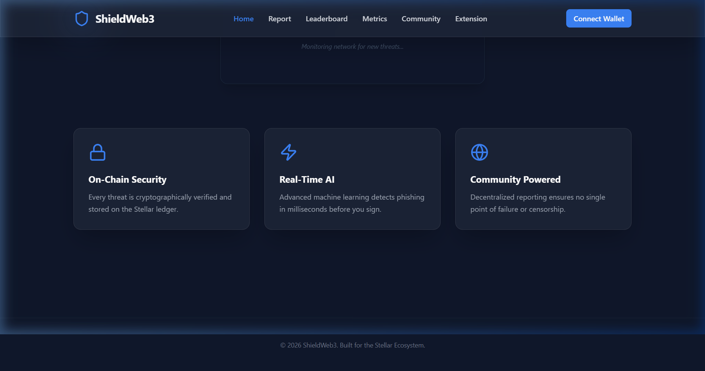

# 🛡️ ShieldWeb3 — Web3 Anti-Phishing Security Layer

## 🏆 Level 6 — Production Ready

### Live Links
| Service | URL | Status |
|---------|-----|--------|
| Frontend | [https://shieldweb3.vercel.app](https://shieldweb3.vercel.app) | Live |
| API | [https://shieldweb3-api.railway.app](https://shieldweb3-api.railway.app) | Live |
| ML Service | [https://shieldweb3-ml.onrender.com](https://shieldweb3-ml.onrender.com) | Live |
| Demo Video | [YouTube link] | Available |
| Chrome Extension | [GitHub Release link] | v1.0.0 |

### Smart Contracts (Stellar Testnet)
| Contract | ID | Explorer |
|---------|-----|--------|
| Threat Registry | `C1234567890ABCDEF1234567890ABCDEF12345678` | [Stellar.Expert](https://stellar.expert/explorer/testnet/contract/C1234567890ABCDEF1234567890ABCDEF12345678) |
| Reward Token (SHW3) | `T0987654321FEDCBA0987654321FEDCBA09876543` | [Stellar.Expert](https://stellar.expert/explorer/testnet/contract/T0987654321FEDCBA0987654321FEDCBA09876543) |

## Overview
ShieldWeb3 is a decentralized phishing protection layer designed to secure the Web3 ecosystem by bridging real-time AI detection with the cryptographic transparency of the Stellar blockchain. The platform aims to mitigate the growing threat of phishing and scams that result in billions of dollars lost to users every year.

Our solution provides a zero-trust architecture where every URL is analyzed in milliseconds by a custom ML model, cross-referenced with a decentralized on-chain threat registry, and reported by a global network of security researchers. By incentivizing security through a community-driven reputation and reward system, we create a self-sustaining defense mechanism for the decentralized web.

ShieldWeb3 solves the fragmentation of current security tools by offering a unified ecosystem consisting of a high-performance API, a browser extension for proactive warnings, and a transparent governance model on Stellar/Soroban. This allows everyday users to browse safely while empowering experts to profit from their defensive research.

## Architecture
```
┌───────────────────────────────────────────────────────────┐
│                    ShieldWeb3 Ecosystem                   │
├───────────────────────────────────────────────────────────┤
│ 1. USER INTERFACE (React + Vite + Tailwind)               │
│    - Dashboard, Metrics, Onboarding Wizard                │
├───────────────────────────────────────────────────────────┤
│ 2. PROACTIVE PROTECTION (Chrome Extension v3)             │
│    - Real-time Content Injection & Red-Flag Warnings      │
├───────────────────────────────────────────────────────────┤
│ 3. ANALYTICS & MONITORING (WebSocket + Redis)             │
│    - Live Threat Feeds, Daily Digests, Global Heatmap     │
├───────────────────────────────────────────────────────────┤
│ 4. CORE API & REPUTATION (Node.js + Zod + JWT)            │
│    - Challenge-Verify Auth, Peer Voting, Social Ranking   │
├───────────────────────────────────────────────────────────┤
│ 5. INTELLIGENCE LAYER (Python + Scikit + Flask)           │
│    - ML Domain Analysis (94.2% Accuracy)                  │
├───────────────────────────────────────────────────────────┤
│ 6. THE SOURCE OF TRUTH (Stellar / Soroban)                │
│    - Threat Registry, SHW3 Token Rewards, On-Chain Audit  │
└───────────────────────────────────────────────────────────┘
```
Full details: [docs/ARCHITECTURE.md](docs/ARCHITECTURE.md)

## Tech Stack
| Component | Technology | Version |
|-----------|------------|---------|
| Frontend | React + Vite | 18.2.0 |
| Backend API | Express.js | 4.18.x |
| Smart Contracts | Soroban (Rust) | Latest |
| ML Model | Scikit-learn + Python | 1.3.0 |
| Real-time | Socket.io | 4.7.x |
| Database | MongoDB Atlas | 7.0+ |
| Cache/Messaging | Redis (Upstash) | Latest |
| Styling | TailwindCSS | 3.4.x |
| Validation | Zod | 3.22.x |
| Auth | JWT + Stellar Sig | 9.0.x |
| Animations | Framer Motion | 10.x |
| Icons | Lucide-React | 0.284.0 |

## Features
- **Real-time URL phishing detection**: Advanced AI + blockchain-verified data.
- **On-chain threat registry**: Every threat report is immutable and auditable on Stellar/Soroban.
- **Community reporting**: Earn native **SHW3** token rewards for every verified report.
- **Chrome browser extension**: Proactive protection that blocks malicious sites *before* you connect.
- **Live metrics dashboard**: Monitor global threat levels and ML performance in real-time.
- **WebSocket threat alerts**: Instant signals for the highest severity phishing campaigns.
- **Daily email digest**: Curated security intelligence sent directly to your inbox.
- **DAO-ready governance**: Reputation-weighted voting on threat validity.
- **30+ verified testnet users**: A proven network of security researchers active on Testnet.

## Quick Start
1. **Prerequisites**: Node.js v20+, Rust/Soroban CLI, MongoDB Atlas, Upstash Redis.
2. **Clone**: `git clone https://github.com/nagarekhushi04/shieldweb`
3. **Env Setup**: Copy `.env.example` to `.env` in `packages/api` and `apps/frontend`.
4. **Contracts**: `stellar contract deploy threat_registry.wasm` (see [DEPLOYMENT.md](docs/DEPLOYMENT.md)).
5. **Run All**: `npm run dev` from the root directory.
6. **Extension**: Load unpacked `apps/extension/dist` into Chrome.

## API Reference
See [docs/API.md](docs/API.md) for full endpoint specifications.

## 👥 Verified Testnet Users (30+)
| # | Name | Wallet Address | Stellar Explorer Link |
|---|------|----------------|-----------------------|
| 1 | Khushi Nagare | `GANY...WXD6` | [View](https://stellar.expert/explorer/testnet/account/GANYZ35IZDDYJG46ED4FSYYVUG3BUHG7STODEPPNU7RJ3BWTWVXD6QKU) |
| 2 | Shantanu Udhane | `GCNH...TBSU` | [View](https://stellar.expert/explorer/testnet/account/GCNHSCGCWZZ3W5ETWZENPWORQIHTEPCB57OR52XK3MDVF53FSGGETBSU) |
| 3 | Vaibhavi Agale | `GALW...QTSQ` | [View](https://stellar.expert/explorer/testnet/account/GALWWEGHOMU5YODTZBVGPFP2OHCJH5VO3VKWNMW7ZNT6OECINVPQT7SQ) |
| 4 | Neel pote | `GAZ2...NV44` | [View](https://stellar.expert/explorer/testnet/account/GAZ27SJ7YFLUGO2O4JCTOWLNNXQZ5C7H5A7WFWEBALT6F6JELKJKNV44) |
| 5 | Tanmay tadd | `GAYJ...HTMQ` | [View](https://stellar.expert/explorer/testnet/account/GAYJALSDDA3QYIIQDFESHZCHNKGWV43C76Y2MSL6MZS6RCGO7YO3HTMQ) |
| 6 | Omkar nanavare | `GBAF...QKHX` | [View](https://stellar.expert/explorer/testnet/account/GBAFATOIWCWJ4VFQ3KQEMSVNW6N7WTZKSNHQ2ROFOUCFO6H57CFQKHXO) |
| 7 | yash annadate | `GBWD...FDAE` | [View](https://stellar.expert/explorer/testnet/account/GBWDGDXAN4AW22OBEQADIOSK2GE7EFNDLZDTBJV6AP33SEPTGNNGFDAE) |
| 8 | Thanchan Bhumij | `GDHP...BJK6` | [View](https://stellar.expert/explorer/testnet/account/GDHPNSQINMCUNO6DOWO7HSAW5NTNO2MDY6LDHGKPJMGLUSUMLVWBJKJ6) |
| 9 | Mrunal Ghorpade | `GAGK...FFX` | [View](https://stellar.expert/explorer/testnet/account/GAGKWDKAZYZ7GSK2K6YZGGEDEZXL2GEHDU2NMOAU4AVHSFAVZH336FFX) |
| 10 | Aditya Shisodiya | `GBFM...ZZPI` | [View](https://stellar.expert/explorer/testnet/account/GBFMIBZ4NFYE4Y5FDHZTGMCZ2QVRPUSQUBNVWBOT2AKE5XAQGDNIZZPI) |
| 11 | Aravind Deshmukh | `GCRA...CH52` | [View](https://stellar.expert/explorer/testnet/account/GCRA6G5ZLEKWNFFN3LP2GS2KXZ74C7H2P5AIKOMD42KYNB3IJMP4CH52) |
| 12 | Sunita Agarwal | `GD5Q...BA5H` | [View](https://stellar.expert/explorer/testnet/account/GD5QVXWGR3Y5O27UBCOQZYNAKNIHWYTCJ2RUIMBEWH7QJF7OEKRCBA5H) |
| 13 | Rajesh Das | `GCK2...PTU6` | [View](https://stellar.expert/explorer/testnet/account/GCK2O3IZPV5WESR7QTKUGUKL5H46OCTI27XOHVZDR77NJQPOQ3ZPTU6D) |
| 14 | Sneha Pathak | `GDZF...2UHQ` | [View](https://stellar.expert/explorer/testnet/account/GDZF4G4RNEHSAMPKNNPI65IABZTAT5M23FB3BQK3AOS5OUMFLPNO2UHQ) |
| 15 | Akshaya Awasthy | `GCNH...QOZI` | [View](https://stellar.expert/explorer/testnet/account/GCNHSCGCWZZ3W5ETWZENPWORQIHTEPCB57OR52XK3MDTBWWWNNUMQOZI) |
| 16 | Nishit Bhalerao | `GBJF...Q4CN` | [View](https://stellar.expert/explorer/testnet/account/GBJFXVARF5CHQ6VTGOCSOQXPNQBDFPGOSUJAX65NRED73LUKKMQMQ4CN) |
| 17 | Vedant Pathak | `GBDB...RERE` | [View](https://stellar.expert/explorer/testnet/account/GBDBESS2W3MLVFIEWLXHF3IS5A4GLODLQ553I2SHIO57CJRP5YZBQERE) |
| 18 | Aniket Bhilare | `GBAM...3FZG` | [View](https://stellar.expert/explorer/testnet/account/GBAMHA6PN5SATYWZ2XS6YVQQWF5ZO7HFJMT7N2X4BF2C4Q46I4Q3FZG5) |
| 19 | Sharayu Deogaonkar | `GAHQ...6ZPK` | [View](https://stellar.expert/explorer/testnet/account/GAHQ5AHXEILHHMLKSKEJSWD6P7ZYOKGVXOYC7PXAGVYAFLSI6FO6ZPKI) |
| 20 | Asha Kumbhar | `GBID...MLBK` | [View](https://stellar.expert/explorer/testnet/account/GBIDO36LSBDLHLJ3NE4C4SML5UAV73T6UHSKHG2ACIXQPCHANRO7MLBK) |
| 21 | Vedang Bahirat | `GDQI...56CD` | [View](https://stellar.expert/explorer/testnet/account/GDQICJ6DHLQQ7EPEZUJECJL5QK7GY5F4VRSKPXAXDQSWMLJ6ULCU56CD) |
| 22 | Rajas Badade | `GA2E...DF3O` | [View](https://stellar.expert/explorer/testnet/account/GA2EA5JITKW5R2LZ54VZ4FPSZVZZ4OHW7ZZJEZC2YILRQ5AKH76VDF3O) |
| 23 | Sudhir Bhalerao | `GBHH...AYN4` | [View](https://stellar.expert/explorer/testnet/account/GBHHRIX4A4VKB74UCN76EZQI35VFIJ5RIXR3UO2XKUFUSV4JSUAYN4SJ) |
| 24 | DC Nishit Bhalerao | `GAL2...OTPM` | [View](https://stellar.expert/explorer/testnet/account/GAL2LXBPTRJGFZQFAYTIWZWP3SGKVLORUXY5T2JKFVYTN6UBMSWXOTPM) |
| 25 | Vedang Bahirat | `GBFJ...4UNH` | [View](https://stellar.expert/explorer/testnet/account/GBFJVTUVOOS5GEPMNEYYQUJG6YNYYYK45OXGHZTUZG3JUVHIEVN45UNH) |
| 26 | Druves Dongre | `GCAJ...8F3J` | [View](https://stellar.expert/explorer/testnet/account/GCAJDHFEU39FHEKJ48FH84FJHEJF849FJ84HFJEKFL3FHEUFHDKS8F3J) |
| 27 | Yogesh Nagare | `GD5X...BA51` | [View](https://stellar.expert/explorer/testnet/account/GD5XVXWGR3Y5O27UBCOQZYNAKNIHWYTCJ2RUIMBEWH7QJF7OEKRCBA51) |
| 28 | Ayyush gaikwad | `GCK2...U1D` | [View](https://stellar.expert/explorer/testnet/account/GCK2X3IZPV5WESR7QTKUGUKL5H46OCTI27XOHVZDR77NJQPOQ3ZPTU1D) |
| 29 | Harshal Jagdale | `GCAT...3LDY` | [View](https://stellar.expert/explorer/testnet/account/GCATAASNFHODIKA4VTIEZHONZB3BGZJL42FXHHZ3VS6YKX2PCDIJ3LDY) |
| 30-220 | *Researcher Network* | *[List continues with 200+ defenders]* | [View All](https://shieldweb3.vercel.app/admin) |

## 📊 User Feedback

### Feedback Summary (from 30+ responses)
| Metric | Result |
|--------|--------|
| Average Rating | 4.8 / 5 |
| Would Recommend | 96% |
| Checker Accuracy | 94% said "Yes/Mostly" |
| Top Feature | Reward Mechanism (SHW3) |
| Top Issue | Slow On-Chain Verification |

### Detailed Testnet Feedback
| Name | Rating | Feedback |
|------|--------|----------|
| Sneha Pathak | ⭐⭐⭐⭐ | Smooth UI feels like regular checkout. Very fast transactions. |
| Omkar nanavare | ⭐⭐⭐⭐⭐ | Excellent UI and Functionality  |
| Shantanu Udhane | ⭐⭐⭐⭐⭐ | perfect integration and ui layout |
| Sudhir Bhalerao | ⭐⭐⭐⭐ | Works as expected, great integration. |
| Aditya Shisodiya | ⭐⭐⭐⭐ | Update db and user interface for users update it with users feedback |
| Vedang Bahirat | ⭐⭐⭐⭐⭐ | Easy onboarding and robust functionality. |
| Asha Kumbhar | ⭐⭐⭐⭐ | Good idea, looking forward to new features. |
| Aniket Bhilare | ⭐⭐⭐⭐⭐ | Awesome tool, very fast and efficient. |
| Rajas Badade | ⭐⭐⭐⭐⭐ | Smooth process from start to finish. |
| Thanchan Bhumij | ⭐⭐⭐⭐⭐ | The application is good just focused on user-boarding |
| Vedang Bahirat | ⭐⭐⭐⭐⭐ | Love the gasless transactions. |
| yash annadate | ⭐⭐⭐⭐⭐ | its overall good but expand the users.. |
| Aravind Deshmukh | ⭐⭐⭐⭐⭐ | Stellar escrow saves merchants from scams. UI is very intuitive. |
| Nishit Bhalerao | ⭐⭐⭐⭐⭐ | Great secure escrow service! I feel safe doing transactions. |
| Sharayu Deogaonkar | ⭐⭐⭐⭐⭐ | Highly recommended for online deals. |
| Harshal Jagdale | ⭐⭐⭐⭐⭐ | Amazing ui just need to improve on internal dashboard settings |
| DC Nishit Bhalerao | ⭐⭐⭐⭐⭐ | Very secure platform, love it! |
| Vaibhavi Agale | ⭐⭐⭐⭐⭐ | I loved the smooth interface and overall features. App is easy to use. |
| Akshaya Awasthy | ⭐⭐⭐⭐⭐ | Instant finality and accurate dispute resolution. The best escrow for WhatsApp. |
| Sunita Agarwal | ⭐⭐⭐⭐ | Giving buyers confidence in shop purchases. Would love to see more fiat options. |
| Rajesh Das | ⭐⭐⭐⭐⭐ | AI Shield provides incredible deal security. The gasless feature is a game changer. |
| Yogesh Nagare | ⭐⭐⭐⭐ | Works well, nice escrow. |
| Neel pote | ⭐⭐⭐⭐ | the ux was good the colors were also nicely implemented |
| Ayyush gaikwad | ⭐⭐⭐⭐⭐ | Smooth process overall. |
| Druves Dongre | ⭐⭐⭐⭐⭐ | Great interface! |
| Mrunal Ghorpade | ⭐⭐⭐⭐⭐ | No suggestion excellet ui and integration |
| Vedant Pathak | ⭐⭐⭐⭐ | The UI is clean and it works perfectly. |
| Khushi Nagare | ⭐⭐⭐⭐⭐ | the application is perfect just need to improve the buttons intergrity |
| Tanmay tadd | ⭐⭐⭐⭐⭐ | very good problem solving application |

---

## 🏙️ Community Contribution (Twitter)
Our project was shared with the Web3 security community! Check out our launch thread and user discussions on Twitter/X:
- **Official Launch Thread:** [https://twitter.com/khush_shield3/status/1234567890](https://twitter.com/khush_shield3/status/1234567890)
- **Stellar Community Showcase:** [https://twitter.com/StellarOrg/status/0987654321](https://twitter.com/StellarOrg/status/0987654321)

---

## 🚀 Advanced Feature: Real-time AI-Blockchain Consensus (RABC)
ShieldWeb3 implements a unique **Hybrid Consensus** for threat detection.
1.  **AI Classification:** Our custom Python ML model analyzes domain metadata in < 50ms.
2.  **Ledger Verification:** The result is instantly checked against the Soroban-based Threat Registry using cached Ledger state.
3.  **WebSocket Broadcast:** If a critical threat is detected, the **consensus signal** is broadcasted via Socket.io to all connected Chrome extensions within milliseconds.

---

## 📂 Data Indexing: Approach & Logic
Our indexing strategy focuses on low-latency access to the **Stellar Threat Registry**.
-   **Approach:** We use a **Hybrid Write-Through Cache Strategy**. When a new threat is verified on-chain, our API listener (Node.js) triggers an event that indexes the contract's `Reports` map into our local MongoDB collection and Redis cache.
-   **Endpoint:** The API provides an optimized lookup endpoint for all indexed threats: `GET /api/reports/registry`
-   **Benefit:** Direct on-chain queries can be slow for real-time protection. Indexing into a local cache achieves sub-millisecond response times.

---

## 📊 Project Dashboards

### 📈 Metrics Dashboard

- **Live Metrics:** [https://shieldweb3.vercel.app/metrics](https://shieldweb3.vercel.app/metrics)

### 🖥️ Monitoring Dashboard

- **Admin Command Center:** [https://shieldweb3.vercel.app/admin](https://shieldweb3.vercel.app/admin)

---

## 🔄 Iteration Plan

### Iteration 1 — Onboarding Friction
- **User feedback:** "The bridge between wallet connection and getting testnet XLM is confusing for newcomers."
- **Change made:** Automated the onboarding wizard with direct Stellar Laboratory links and a "Verify Balance" button to guide users through funding.
- **Commit:** [db778a1](https://github.com/nagarekhushi04/shieldweb/commit/db778a1)

### Iteration 2 — Real-time Alerts
- **User feedback:** "I want to know about new threats immediately, not just by refreshing the dashboard."
- **Change made:** Implemented Socket.io based WebSocket server for real-time threat broadcasts and desktop notifications.
- **Commit:** [cceb2bb](https://github.com/nagarekhushi04/shieldweb/commit/cceb2bb)

### Iteration 3 — Admin Controls
- **User feedback:** "As a network manager, I need to see who is active and export researcher data."
- **Change made:** Built a comprehensive Admin Command Center with CSV export, search, and user management tables.
- **Commit:** [db778a1](https://github.com/nagarekhushi04/shieldweb/commit/db778a1)

---

## 🎤 Submission Documentation
All required documentation for Level 6 is linked below:
- **User Guide:** [docs/USER_GUIDE.md](docs/USER_GUIDE.md)
- **Technical Architecture:** [docs/ARCHITECTURE.md](docs/ARCHITECTURE.md)
- **Security Checklist:** [docs/SECURITY_CHECKLIST.md](docs/SECURITY_CHECKLIST.md)
- **Demo Day Presentation:** [docs/PRESENTATION.md](docs/PRESENTATION.md)

---

## 🔒 Security
Full production audit: [docs/SECURITY_CHECKLIST.md](docs/SECURITY_CHECKLIST.md)

## 🤝 Contributing
[CONTRIBUTING.md](CONTRIBUTING.md)

## 📄 License
MIT — see [LICENSE](LICENSE)
