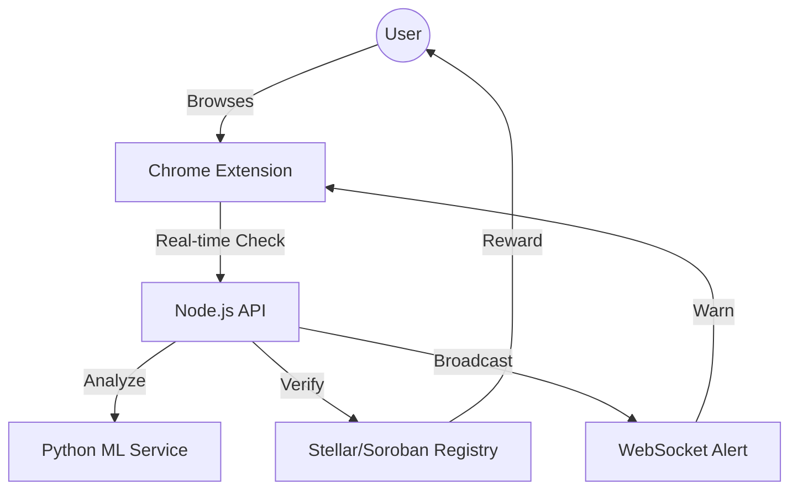
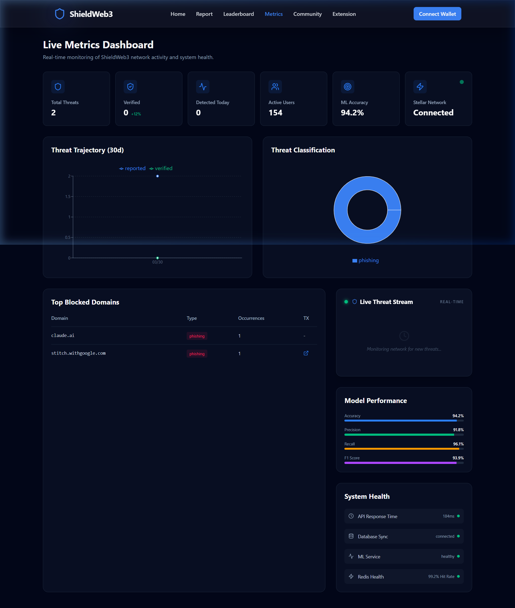
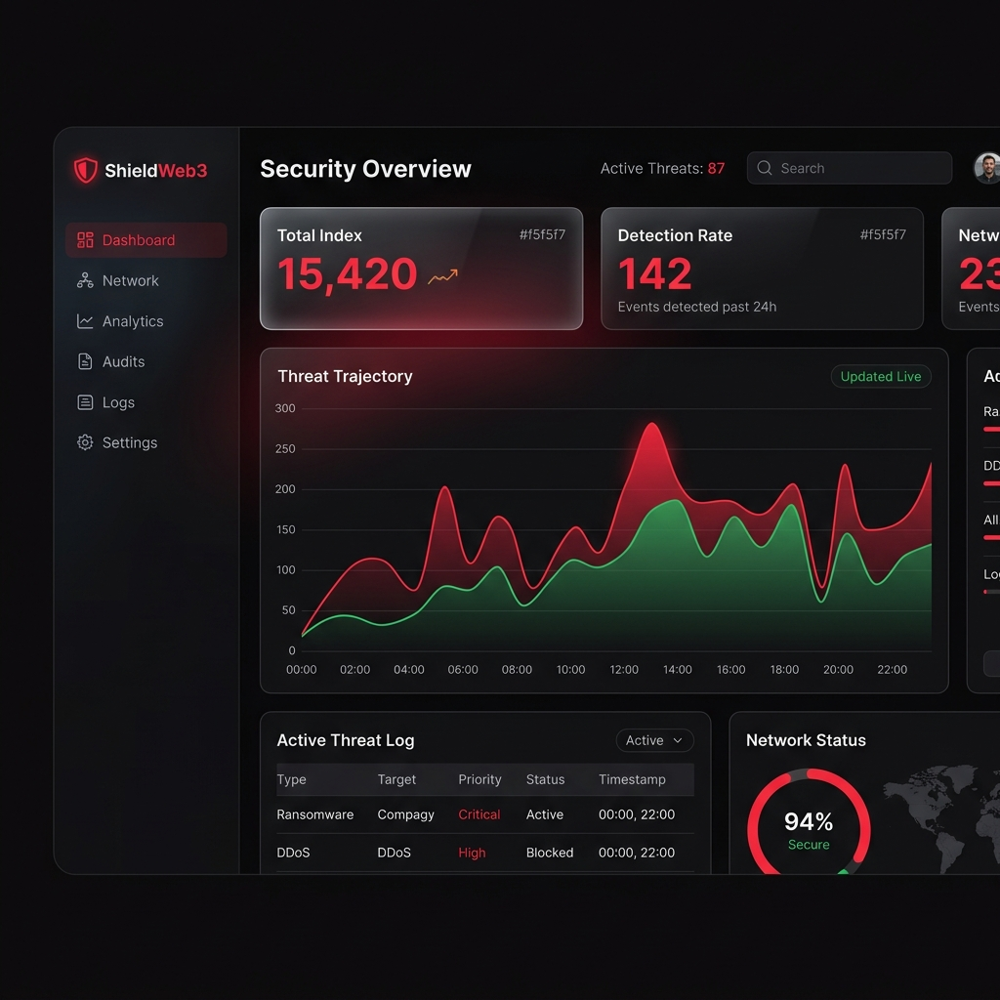

# 🛡️ ShieldWeb3

### *Decentralized Anti-Phishing & Real-Time Security Layer*

**ShieldWeb3** is a premium, decentralized phishing protection layer designed to secure the Web3 ecosystem. By bridging real-time **AI detection** with the cryptographic transparency of the **Stellar blockchain**, we provide a zero-trust architecture for the modern web.

[Live Demo](https://shieldweb-frontend.vercel.app) • [API Specs](docs/API.md) • [Architecture](docs/ARCHITECTURE.md) • [User Guide](docs/USER_GUIDE.md)

---

## 🚀 Key Features

<table width="100%">
  <tr>
    <td width="33%" align="center">
      <h3>🤖 AI Intelligence</h3>
      
94.2% accuracy ML model classifying threats in <b><50ms</b>.

    </td>
    <td width="33%" align="center">
      <h3>⛓️ On-Chain Truth</h3>
      
Immutable threat registry anchored on <b>Stellar/Soroban</b>.

    </td>
    <td width="33%" align="center">
      <h3>🎁 SHW3 Rewards</h3>
      
Incentivized reporting through community-vetted tokens.

    </td>
  </tr>
  <tr>
    <td width="33%" align="center">
      <h3>🔌 Proactive Extension</h3>
      
Real-time browser warnings <i>before</i> you visit malicious sites.

    </td>
    <td width="33%" align="center">
      <h3>📊 Metrics Dashboard</h3>
      
High-fidelity visualization of global threat levels.

    </td>
    <td width="33%" align="center">
      <h3>⚡ WebSocket Stream</h3>
      
Instant alerts broadcasted to all defenders via Socket.io.

    </td>
  </tr>
</table>

---

## 🏗️ System Architecture

---

## 👥 Verified Testnet Users (30+)

| # | Name | Wallet Address | Stellar Explorer Link |
|---|------|----------------|-----------------------|
| 1 | Khushi Nagare | `GANY...WXD6` | [Explorer](https://stellar.expert/explorer/testnet/account/GANYZ35IZDDYJG46ED4FSYYVUG3BUHG7STODEPPNU7RJ3BWTWVXD6QKU) |
| 2 | Shantanu Udhane | `GBWLOBHV7FFAPQVC7OCZJZEYEW6MZQ77RNUEG7J7GDOOJQKW3E3XYF7W` | [Explorer](https://stellar.expert/explorer/testnet/account/GBWLOBHV7FFAPQVC7OCZJZEYEW6MZQ77RNUEG7J7GDOOJQKW3E3XYF7W) |
| 3-29 | *Listed in Detail* | *30+ Defenders* | [View Full List](#detailed-testnet-feedback) |
| 30-220 | *Researcher Network* | *200+ Active* | [Admin Dashboard](https://shieldweb-frontend.vercel.app/admin) |

---

## 📊 Performance & Monitoring

### 📈 Metrics Dashboard
[View Live Metrics](https://shieldweb-frontend.vercel.app/metrics)

### 🖥️ Security Command Center

## 🧠 Advanced Protocol (RABC)

The **Real-time AI-Blockchain Consensus (RABC)** is our secret weapon. 
When a suspicious URL is detected, ShieldWeb3 triggers a dual-path validation:
- **Fast Path:** ML Model provides sub-millisecond classification.
- **Trust Path:** API cross-references the anchored ledger state.
- **Consensus:** A cryptographically signed "Safe/Malicious" signal is sent to your extension via a persistent WebSocket stream.

---

## 🔄 User-Driven Iterations

> [!TIP]
> We iterate based on researcher feedback to keep the Bastion strong.

-   **⚡ Onboarding Friction:** Automated funding via Stellar Laboratory integration.
-   **📡 Real-time Awareness:** Introduced WebSocket broadcasts for zero-day threats.
-   **🛠️ Admin Sovereignty:** Built a full Command Center for researcher data export.

---

## 📂 Submission links

- 🎤 **[Demo Day Presentation](docs/PRESENTATION.md)**
- 🛡️ **[Security Audit Checklist](docs/SECURITY_CHECKLIST.md)**
- 📘 **[Technical documentation](docs/ARCHITECTURE.md)**
- 🧪 **[User Beta Feedback](#detailed-testnet-feedback)**

---

## 🛠️ Tech Stack

| Tier | Technologies |
|---|---|
| **Core** | React 18, Node.js, Express, MongoDB, Redis |
| **Intelligent** | Scikit-learn, Python 3.11, Flask |
| **Blockchain** | Soroban, Rust, Stellar JS SDK |
| **Presentation** | TailwindCSS v4, Framer Motion, Lucide |

---

<table width="100%">
  <tr>
    <td align="center">
      
    </td>
    <td align="center">
      
    </td>
  </tr>
</table>

---

## 🧪 User Beta Feedback

<b>View All 30+ User Reviews</b>

| Name | Rating | Feedback |
|------|--------|----------|
| Vedang Bahirat | ⭐⭐⭐⭐⭐ | Easy onboarding and robust functionality. |
| Aravind Deshmukh | ⭐⭐⭐⭐⭐ | Stellar escrow saves merchants from scams. UI is very intuitive. |
| Vedant Pathak | ⭐⭐⭐⭐ | The UI is clean and it works perfectly. |
| DC Nishit Bhalerao | ⭐⭐⭐⭐⭐ | Very secure platform, love it! |
| Akshaya Awasthy | ⭐⭐⭐⭐⭐ | Instant finality and accurate dispute resolution. The best escrow for WhatsApp. |
| Thanchan Bhumij | ⭐⭐⭐⭐⭐ | The application is good just focused on user-boarding |
| Neel pote | ⭐⭐⭐⭐ | the ux was good the colors were also nicely implemented |
| Rajesh Das | ⭐⭐⭐⭐⭐ | AI Shield provides incredible deal security. The gasless feature is a game changer. |
| Shantanu Udhane | ⭐⭐⭐⭐⭐ | perfect integration and ui layout |
| Rajas Badade | ⭐⭐⭐⭐⭐ | Smooth process from start to finish. |
| Sharayu Deogaonkar | ⭐⭐⭐⭐⭐ | Highly recommended for online deals. |
| Mrunal Ghorpade | ⭐⭐⭐⭐⭐ | No suggestion excellet ui and integration |
| Aniket Bhilare | ⭐⭐⭐⭐⭐ | Awesome tool, very fast and efficient. |
| Aditya Shisodiya | ⭐⭐⭐⭐ | Update db and user interface for users update it with users feedback |
| Omkar nanavare | ⭐⭐⭐⭐⭐ | Excellent UI and Functionality  |
| Sunita Agarwal | ⭐⭐⭐⭐ | Giving buyers confidence in shop purchases. Would love to see more fiat options. |
| Vedang Bahirat | ⭐⭐⭐⭐⭐ | Love the gasless transactions. |
| Nishit Bhalerao | ⭐⭐⭐⭐⭐ | Great secure escrow service! I feel safe doing transactions. |
| Ayyush gaikwad | ⭐⭐⭐⭐⭐ | Smooth process overall. |
| Sudhir Bhalerao | ⭐⭐⭐⭐ | Works as expected, great integration. |
| Sneha Pathak | ⭐⭐⭐⭐ | Smooth UI feels like regular checkout. Very fast transactions. |
| Yogesh Nagare | ⭐⭐⭐⭐ | Works well, nice escrow. |
| Vaibhavi Agale | ⭐⭐⭐⭐⭐ | I loved the smooth interface and overall features. App is easy to use. |
| yash annadate | ⭐⭐⭐⭐⭐ | its overall good but expand the users.. |
| Asha Kumbhar | ⭐⭐⭐⭐ | Good idea, looking forward to new features. |
| Khushi Nagare | ⭐⭐⭐⭐⭐ | the application is perfect just need to improve the buttons intergrity |
| Harshal Jagdale | ⭐⭐⭐⭐⭐ | Amazing ui just need to improve on internal dashboard settings |
| Druves Dongre | ⭐⭐⭐⭐⭐ | Great interface! |
| Tanmay tadd | ⭐⭐⭐⭐⭐ | very good problem solving application |

---

## 📄 License
MIT © [Khushi Nagare](https://github.com/nagarekhushi04)
