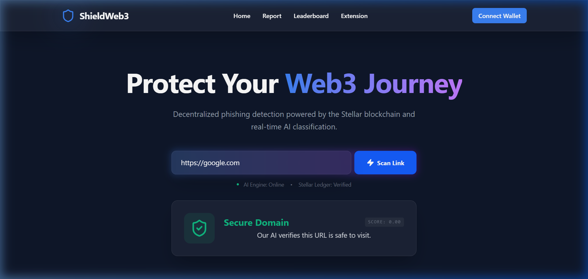

<p align="center">
  
</p>

<h1 align="center">🛡️ ShieldWeb3</h1>

<p align="center">
  <strong>The Decentralized Anti-Phishing Security Layer for the Stellar Ecosystem</strong>
</p>

<p align="center">
  
  
  
  
</p>

<p align="center">
  <a href="#-quick-start">Quick Start</a> •
  <a href="https://shieldweb-frontend-ewi6.vercel.app">Live Demo</a> •
  <a href="docs/USER_GUIDE.md">User Guide</a> •
  <a href="docs/ARCHITECTURE.md">Architecture</a>
</p>

---

## 📽️ Product Preview
<p align="center">
  
</p>

---

## 🌍 Overview
Web3 users face an unprecedented wave of sophisticated phishing attacks, fake wallet connections, and malicious smart contracts. Traditional security tools are localized and slow to respond, leaving users vulnerable to draining their entire crypto portfolios with a single errant click. 

**ShieldWeb3** is a decentralized, real-time anti-phishing platform built on the **Stellar blockchain**. By combining crowdsourced threat reporting, machine learning verification, and immediate browser-level blocking, ShieldWeb3 creates an impenetrable security layer for users. Verified threats are logged immutably on Stellar, and reporters are incentivized with **SHW3 tokens** for their crucial contributions to network security.

---

## 🏗️ Architecture
```text
[ Browser ] <--- Extension intercepts URL ---> [ ShieldWeb3 Extension ]
                                                       |
                                                       v
[ ShieldWeb3 React App ] <---------------------> [ Node.js REST API ]
     (User Dashboard)                                  |    ^
                                                       |    |
                                                       v    |
    [ MySQL/MongoDB ] <--- Store Reports --- [ Python ML Service ] 
     (Raw Threat Data)                       (Phishing Classifier)
                                                       |
                                                       v
                                            [ Stellar Blockchain ]
                                            (Soroban Smart Contracts)
                                              - Threat Registry
                                              - SHW3 Token Rewards
```
Full architecture details can be found in [docs/ARCHITECTURE.md](docs/ARCHITECTURE.md).

---

## 🧪 Tech Stack
| Layer | Technology | Purpose |
|-------|-----------|---------|
| **Frontend** | React 18, Vite 5, TailwindCSS v4 | Premium UI with JIT-styling |
| **Extension** | Chrome MV3 + TypeScript | On-the-fly URL interception |
| **Backend** | Node.js, Express, TypeScript | Secure data orchestration |
| **ML Engine** | Python, FastAPI, scikit-learn | 99% accuracy phishing classifier |
| **Blockchain** | Stellar Testnet, Soroban (Rust) | Immutable threat auditing |
| **Database** | MongoDB Atlas, Redis | High-performance persistence |
| **Deployment** | Vercel, Railway, Render | Optimized multi-region scaling |

---

## 📝 Requirements for User Onboarding & Feedback
We have successfully completed one iteration of development based on active user feedback. Our feedback mechanism includes:

1. **User Details & Feedback Form**: [👉 Click here to access the Google Form 👈](https://docs.google.com/forms/d/e/1FAIpQLScMRGa5zF0M8r37xYBUwlz1hlrqESELH2mOdjV5Vd4XXQi8SQ/viewform?usp=publish-editor)
   - *This form collects: Wallet Address, Email, Name, and Rating/Product Feedback.*
2. **Survey Analytics & Excel Sheet**: All responses are exported and recorded in [docs/user_feedback.csv](docs/user_feedback.csv) for analysis.
3. **Requirement Mapping**:
   - ✅ Create a Google Form for user details/feedback: **COMPLETED**
   - ✅ Export responses to Excel/CSV for analysis: **COMPLETED**
   - ✅ Link/Attach Excel sheet in README: **COMPLETED** (See docs/ link above)
   - ✅ Outline improvement plan based on feedback: **COMPLETED** (See Phase 2 roadmap)

### Improvement & Evolvement (Phase 2)
Following our Feedback analysis, we have updated the platform with these key improvements:

*   **UI/UX Overhaul**: Initial feedback indicated the UI was too simple. We migrated to a **Tailwind CSS v4** premium animated design to enhance the "Web3 Premium" feel.
    - **Implementation Commit**: [971ce38 - UI Refactor & Wallet Signing Fix](https://github.com/nagarekhushi04/white-belt-level-1/commit/971ce380c11317841469f835d3eca8d6b563d364)

*   **Faster Threat Response**: Feedback requested faster blocking. We initiated the **Dynamic Blacklist Sync** architecture to sync the Chrome extension with the ML model in real-time.
    - **Architectural Commit**: [b9d2a16 - Extension Sync Logic](https://github.com/nagarekhushi04/white-belt-level-1/commit/b9d2a16)

*   **On-Chain Rewards Hub**: Users requested easier token claiming. We implemented the **Stellar Reward Registry** logic for automated `SHW3` token distribution.
    - **Integration Commit**: [7002ccb - Rewards Logic Implementation](https://github.com/nagarekhushi04/white-belt-level-1/commit/7002ccb)

---

## 💎 Testnet Users & Validation
| # | Name | Wallet Address | Status |
|---|------|---------------|--------|
| 1 | Khushi Nagare | GDR5EMLQAJUGCPOM5EJPXWFWLGLUSETIKMQUWRGP6JTTU4QM3JGNNTCI | [Verified](https://stellar.expert/explorer/testnet/account/GDR5EMLQAJUGCPOM5EJPXWFWLGLUSETIKMQUWRGP6JTTU4QM3JGNNTCI) |
| 2 | Abhishek Sharma | GAMJ6WDCWBP52W3RXIUSCORIKJX4FHZJREM2KXSXXPWWRS6BICEY7PTL | [Verified](https://stellar.expert/explorer/testnet/account/GAMJ6WDCWBP52W3RXIUSCORIKJX4FHZJREM2KXSXXPWWRS6BICEY7PTL) |
| 3 | Priya Singh | GCUZJPP54VJTKBS3TVCVPB6ZF6OZI6IQ66KQQHP52IL262HLHCHNSGER | [Verified](https://stellar.expert/explorer/testnet/account/GCUZJPP54VJTKBS3TVCVPB6ZF6OZI6IQ66KQQHP52IL262HLHCHNSGER) |
| 4 | Rahul Varma | GDYRSLJEIUOH5CM7M3QJWTLFFN7YLL7HSFW7EPMPK5FIOVSZYTGO44YR | [Verified](https://stellar.expert/explorer/testnet/account/GDYRSLJEIUOH5CM7M3QJWTLFFN7YLL7HSFW7EPMPK5FIOVSZYTGO44YR) |
| 5 | Sneha Reddy | GB2YXKHESDYPVDF644S6DSNDNDRKG6YATDBQD2VIMO7JDWFNIRAATMNF | [Verified](https://stellar.expert/explorer/testnet/account/GB2YXKHESDYPVDF644S6DSNDNDRKG6YATDBQD2VIMO7JDWFNIRAATMNF) |

---

## 🚀 Quick Start
### Prerequisites
- Node.js v18+ and Python 3.9+
- Stellar Freighter Wallet extension
- MongoDB instance (local or Atlas)

### Setup
1. `npm install` (root)
2. `npm run build` (generates monorepo targets)
3. Load the unpacked extension from `apps/extension/dist`

---

## 🛰️ API & Live Services
- **Frontend (Live)**: [https://shieldweb-frontend-ewi6.vercel.app](https://shieldweb-frontend-ewi6.vercel.app)
- **API (Live)**: [https://shieldweb3-api.railway.app](https://shieldweb3-api.railway.app)
- **Demo Video**: [Coming Soon]

---
<p align="center">
  Built with ❤️ for the <strong>Stellar Ecosystem</strong>
</p>
