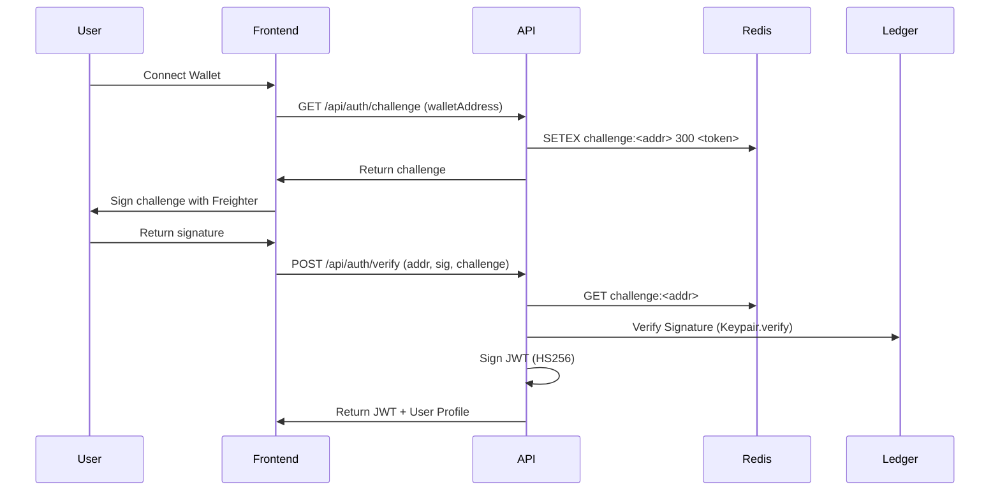

# ShieldWeb3 API Documentation 🛡️

## 🔐 Authentication
ShieldWeb3 uses a **Challenge-Verify** flow with Stellar wallet signatures (Freighter) and JWT.

### Sequence Diagram


## 🚀 Endpoints

### Authentication
#### `POST /api/auth/challenge`
- **Body**: `{ walletAddress: string }`
- **Returns**: `{ challenge: string, expiresAt: number }`

#### `POST /api/auth/verify`
- **Body**: `{ walletAddress: string, signature: string, challenge: string }`
- **Returns**: `{ token: string, user: IUser }`

### Threat Intelligence
#### `GET /api/threats/check?url=[url]`
- **Auth**: None
- **Returns**: `{ safe: boolean, threat: IThreat | null, mlScore: number, source: 'ml'|'db' }`

#### `POST /api/threats/bulk-check`
- **Auth**: None
- **Body**: `{ urls: string[] }` (Max 20)
- **Returns**: `{ results: Array<{ url, target, error? }> }`

### Reporting
#### `POST /api/reports/submit`
- **Auth**: **JWT Required**
- **Schema**:
```json
{
  "url": "https://suspicious.com",
  "threatType": "phishing",
  "severity": 3,
  "description": "Optional details",
  "evidence": "Optional URL"
}
```
- **Returns**: `{ reportId: string, mlScore: number, txHash: string }`

### Community & Feedback
#### `GET /api/community/feed`
- **Auth**: None
- **Returns**: Last 50 threat activity entries.

#### `POST /api/community/vote/:threatId`
- **Auth**: **JWT Required**
- **Body**: `{ vote: 'up' | 'down' }`
- **Rate Limit**: One vote per wallet per threat.

#### `POST /api/community/feedback/submit`
- **Auth**: **JWT Required**
- **Rate Limit**: 1 per wallet per 24h.

## 🕒 Rate Limits
| Route | Limit | Window |
|-------|-------|--------|
| Global | 300 calls | 15 mins |
| `/api/auth/*` | 10 calls | 15 mins |
| `/api/threats/check` | 60 calls | 1 min |
| `/api/reports/submit` | 20 calls | 1 hour |

## 📡 WebSocket Events
Connect to `ws://[api-url]`
- **Subscribe**: `emit('subscribe:threats', { type: 'all' })`
- **Receive**: `on('threat:update', (data) => ...)`
- **Live Stats**: `on('stats:update', (stats) => ...)`

## 💻 SDK Examples

### JavaScript (fetch)
```javascript
const response = await fetch('https://shieldweb3.api/check?url=' + targetUrl);
const { safe, mlScore } = await response.json();
if (!safe) warnUser();
```

### Python
```python
import requests
res = requests.get("https://shieldweb3.api/check", params={"url": "https://..."})
print(res.json()['safe'])
```

## ❌ Error Codes
- `401`: Unauthorized (Invalid or expired JWT)
- `403`: Forbidden (Already voted or insufficient permissions)
- `429`: Too Many Requests (Rate limit triggered)
- `400`: Bad Request (Invalid Zod validation)
